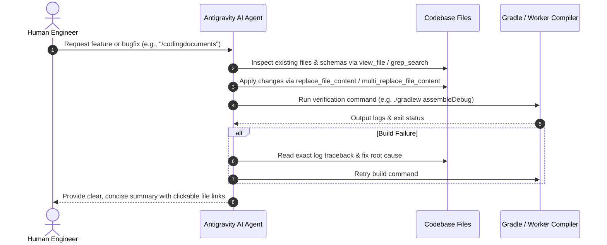

# RIDERsYNK AI Collaboration & Pair Programming Workflow

> [!NOTE]
> This guide defines protocols for AI coding agents (Google Antigravity, Gemini, GitHub Copilot) working on the **RIDERsYNK** codebase alongside human engineers.

---

## 1. Core Operating Principles

1. **Always Inspect Authority Sources**: Never guess column names, variable names, or file paths. Inspect `SavedTrip.kt`, `index.ts`, `supabase_schema.sql`, or `build.gradle` before writing code.
2. **Empirical Verification Required**: Never claim a task or feature is complete without running verification commands (`./gradlew assembleDebug` or `npm test`).
3. **No Superficial Symptom Patches**: Fix root causes; never swallow exceptions silently or delete failing assertions.
4. **Preserve Database Multi-Tier Alignment**: Any edit to data models in Kotlin must be reflected in `index.ts` (Cloudflare Worker) and `supabase_schema.sql` (Supabase Postgres).

---

## 2. AI Subagent & Execution Loops

---

## 3. Pair-Programming Boundaries

| Action | Allowed for AI Agent | Requires Human Review |
| :--- | :---: | :---: |
| Modify Kotlin ViewModels & Repositories | Yes | No |
| Add Cloudflare Edge API endpoints | Yes | No |
| Execute `./gradlew assembleDebug` | Yes | No |
| Modify Supabase Security Rules (RLS) | Yes | Yes |
| Delete production D1/Supabase databases | **NO (Blocked)** | **YES (Explicit Consent)** |
