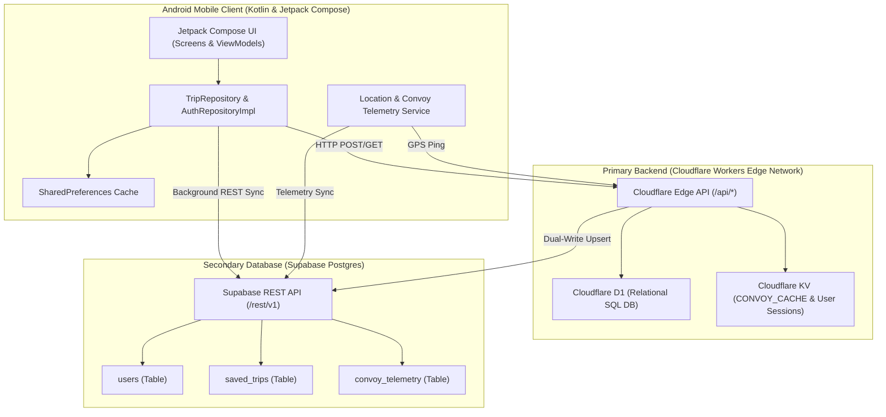

# RIDERsYNK System Architecture & Topology

> [!NOTE]
> This document provides an architectural spec of the **RIDERsYNK** platform, covering the Android Kotlin client, Cloudflare Edge API, and Supabase Postgres secondary database.

---

## 1. System Topology Overview

RIDERsYNK uses a high-availability, multi-tiered architecture designed for low-latency live convoy telemetry, trip planning, and offline resilience.

---

## 2. Tech Stack Tokens

| Layer | Component | Technologies / Frameworks |
| :--- | :--- | :--- |
| **Mobile Client** | UI & State | Android Kotlin, Jetpack Compose, Material3, Coroutines Flow |
| | Maps & Location | Google Maps Android SDK, Fused Location Provider |
| | Storage | SharedPreferences, JSON Serialization |
| **Edge API** | Runtime & Hosting | Cloudflare Workers Edge Network (TypeScript) |
| | Primary Database | Cloudflare D1 (SQLite) |
| | Caching & KV | Cloudflare KV (`CONVOY_CACHE`) |
| | Security | Cloudflare Turnstile Bot Protection |
| **Postgres DB** | Secondary DB | Supabase Postgres (`oktfyxdrvscmifomtlkp`) |
| | Data API | Supabase REST API & `@supabase/supabase-js` |
| **Authentication** | Providers | Google ID Token JWT, Cloudflare Edge Auth, Firebase Auth |

---

## 3. Core Schemas & Data Models

### 3.1 `users` Table Schema
- `uid` (`TEXT PRIMARY KEY`): User unique ID (e.g. `google_102...` or `cf_usr_...`).
- `email` (`TEXT UNIQUE`): User email address.
- `display_name` (`TEXT NOT NULL`): Rider display name.
- `photo_url` (`TEXT`): Profile photo URL.
- `auth_provider` (`TEXT`): Auth provider name (`google`, `email`).
- `vehicle_model` (`TEXT`): Registered motorcycle/vehicle model name.
- `active_vehicle_id` (`TEXT`): Active vehicle ID string.
- `emergency_contact` (`TEXT`): Emergency contact phone number.
- `created_at` (`BIGINT`): Epoch timestamp in milliseconds.

### 3.2 `saved_trips` Table Schema
- `trip_id` (`TEXT PRIMARY KEY`): Trip unique identifier.
- `planner_id` (`TEXT NOT NULL`): Host user ID.
- `title` (`TEXT NOT NULL`): Trip title.
- `origin_name` (`TEXT NOT NULL`): Origin city/location.
- `destination_name` (`TEXT NOT NULL`): Destination city/location.
- `start_lat` / `start_lng` (`DOUBLE PRECISION`): Coordinates of start point.
- `dest_lat` / `dest_lng` (`DOUBLE PRECISION`): Coordinates of destination.
- `distance_km` (`DOUBLE PRECISION`): Total planned route distance in kilometers.
- `duration_minutes` (`INT`): Estimated trip duration in minutes.
- `category` (`TEXT`): `ONGOING`, `UPCOMING`, or `COMPLETED`.
- `lobby_code` (`TEXT UNIQUE`): 6-character alphanumeric join code.
- `scheduled_date` (`TEXT`): Scheduled date string.
- `active_riders_count` (`INT`): Current joined riders count.
- `created_at` (`BIGINT`): Epoch timestamp in milliseconds.

### 3.3 `convoy_telemetry` Table Schema
- `session_id` (`TEXT`): Active trip session ID.
- `rider_id` (`TEXT`): Rider user ID.
- `rider_name` (`TEXT`): Rider display name.
- `lat` / `lng` (`DOUBLE PRECISION`): Live GPS coordinates.
- `speed_kmh` (`DOUBLE PRECISION`): Live speed in km/h.
- `battery_pct` (`INT`): Device battery percentage.
- `updated_at` (`BIGINT`): Last ping epoch timestamp.

---

## 4. Multi-Layer Database Sync Strategy

RIDERsYNK employs a 3-layer storage model:

1. **Layer 1: Local Cache (`SharedPreferences`)**: Immediate read/write on mobile device.
2. **Layer 2: Cloudflare Edge (`Workers + D1 + KV`)**: Low-latency edge execution point for active riders and API requests.
3. **Layer 3: Supabase Postgres**: Secondary persistent relational store populated via dual-write from Cloudflare Workers and background REST sync from the Android client.

---

## 5. UI Design System & Data Integrity Principles

1. **Zero Fake Data Policy**: All dashboard counters, completed ride totals, and total distance calculations must reflect 100% authentic saved/completed user trips. No hardcoded default additions or mock offsets are permitted in production builds.
2. **High-Contrast Form Inputs**: All Compose `OutlinedTextField` instances must explicitly declare high-contrast dark container backgrounds (`Color(0xFF0F172A)`), crisp white text (`Color(0xFFFFFFFF)`), section-matched labels and placeholders (`Color(0xFF94A3B8)` / `Color(0xFF64748B)`), and high-visibility cyan cursors (`Color(0xFF00F0FF)`).
3. **Real-Time Convoy Member Sync & Broadcast Notifications**: All joined trip members (`joinedRiders`) are synced in real-time across devices via background polling (`3s`) on Cloudflare Workers Edge API and Supabase. Every joined rider is mapped to `activeConvoyMembers` for immediate rendering on Google Maps pins, Top Leaderboard overlays, and Convoy Rosters, with real-time broadcast banners (`🎉 New Convoy Member Joined...`) notifying all riders automatically upon roster updates.

