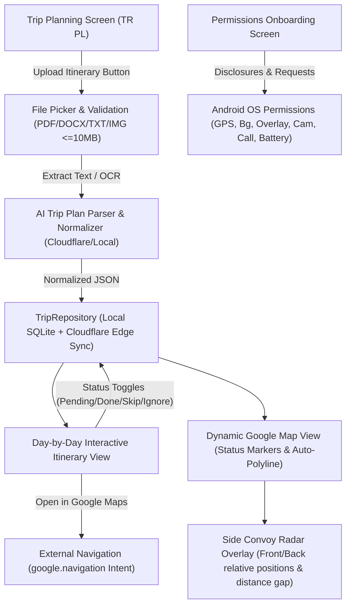

# Feature Specification: Automated Trip Planner, Real-Time Itinerary Tracker & Convoy Radar

**Date:** 2026-09-28  
**Project:** RIDERsYNK (Android App + Cloudflare Edge Backend)  
**Status:** Approved for Implementation Planning

---

## 1. Executive Summary & Goals
This feature empowers motorcycle touring groups and solo riders to:
1. Upload and automatically extract structured multi-day trip plans from documents (PDF, DOCX, TXT, Images).
2. Manage sequential stops with real-time status tracking (`PENDING`, `COMPLETED`, `SKIPPED`, `IGNORED`) persisted locally and synced across the convoy.
3. Dynamically visualize routes on an embedded Google Map, auto-adjusting route corridors around active stops.
4. Launch official Google Maps turn-by-turn navigation with a single tap.
5. Track convoy partners in real-time via a **Side Map Convoy Radar** showing who is in front/behind and the exact distance gap in meters/KM.
6. Provide a Google Play policy-compliant Permissions Onboarding workflow for GPS, background tracking, overlay, camera, calling, and battery exemptions.

---

## 2. Architectural Components

---

## 3. Detailed Task Specifications

### Task 1: "Upload Itinerary" Entry Point & Validation
* **Button:** Prominently placed in the Trip Planning screen header: `"📁 Upload Itinerary Document / Image"`.
* **MIME Types:** `.pdf`, `.docx`, `.txt`, `.jpg`, `.png` via `ActivityResultContracts.GetContent()`.
* **Validation:** Client-side file size check ($\le 10\text{ MB}$).
* **Progress HUD:** Multi-step loading feedback (*Reading Document $\rightarrow$ AI Extracting Itinerary $\rightarrow$ Resolving Coordinates*).

### Task 2: Document Parsing & AI Trip Plan Extraction Engine
* **Data Models:**
  * `ItineraryStop`: `stopId`, `stopName`, `activityDescription`, `estimatedVisitTime`, `rawLocationText`, `latitude`, `longitude`, `status`, `orderIndex`.
  * `ItineraryDay`: `dayNumber`, `dayTitle`, `date`, `stops: List<ItineraryStop>`.
  * `AutomatedTripPlan`: `planId`, `tripTitle`, `totalDuration`, `startDate`, `endDate`, `days: List<ItineraryDay>`.
* **Extraction:** Cloudflare `/api/trip/parse-itinerary` + robust on-device heuristic parser capable of extracting stops, timings, and addresses/URLs.
* **Coordinate Normalization:** Geocodes addresses and converts Google Maps links to validated `LatLng`.

### Task 3: Itinerary View with Status Management
* **Timeline UI:** Sticky Day selector (Day 1, Day 2...) with sequential stop cards.
* **Status States:**
  * ⏳ `PENDING`: Active milestone (Default).
  * ✅ `COMPLETED`: Checked off, marker turns green.
  * ⏭️ `SKIPPED`: Bypassed, excluded from route line.
  * 🚫 `IGNORED`: Struck through, excluded from routing.
* **Persistence:** Instant local saving in `TripRepository` and synced with Cloudflare backend `/api/trip/stop/status`.

### Task 4: Dynamic In-App Map Integration
* **Status Markers:**
  * `PENDING`: High-visibility Cyan/Amber pin with stop index.
  * `COMPLETED`: Green pin with checkmark icon.
  * `SKIPPED` / `IGNORED`: Semi-transparent grey or hidden from polyline.
* **Live Route Corridor:** Directions API recalculates turn-by-turn road polyline connecting only `PENDING` and `COMPLETED` stops in sequential order.

### Task 5: External Map Redirection & Convoy Radar Overlay
* **Navigation Action Toggle:**
  * 📱 **"In-App HUD"**: Centers cockpit camera on waypoint.
  * 🗺️ **"Google Maps"**: Fires `google.navigation:q=lat,lng` Intent for official turn-by-turn navigation.
* **Convoy Radar Overlay (Side Map HUD):**
  * Displays group travel companions in a floating side panel.
  * Calculates along-track / straight-line distance relative to current user's GPS:
    * **"⬆️ AHEAD (+X.X km)"** for riders in front.
    * **"⬇️ BEHIND (-X.X km)"** for riders behind.
    * **"🟢 LEVEL (WITH YOU)"** for riders within 50m.
  * Shows live speed (km/h) and one-tap voice call / focus button.

### Task 6: Permissions & Privacy Onboarding Flow
* **Disclosure Modal:** User-friendly permission explainer matching Google Play Store Safety policies:
  1. 📍 **GPS & Location** (`ACCESS_FINE_LOCATION`, `ACCESS_COARSE_LOCATION`): Navigation & Convoy Radar.
  2. 🔄 **Background Location** (`ACCESS_BACKGROUND_LOCATION`, `FOREGROUND_SERVICE_LOCATION`): Screen-off tracking.
  3. 🪟 **Overlay on Phone Screen** (`SYSTEM_ALERT_WINDOW`): Floating HUD over Google Maps.
  4. 📷 **Camera** (`CAMERA`): QR code scanning & lobby join.
  5. 📞 **Calling** (`CALL_PHONE`): One-tap emergency / group partner calling.
  6. 🔋 **Battery Optimization Exemption** (`REQUEST_IGNORE_BATTERY_OPTIMIZATIONS`): Prevents sleep during long highway rides.

---

## 4. Release Constraints
* **No automatic APK compilation:** The system will prompt the user (*"Do you want to create an APK with this update?"*) before executing any build tasks.
